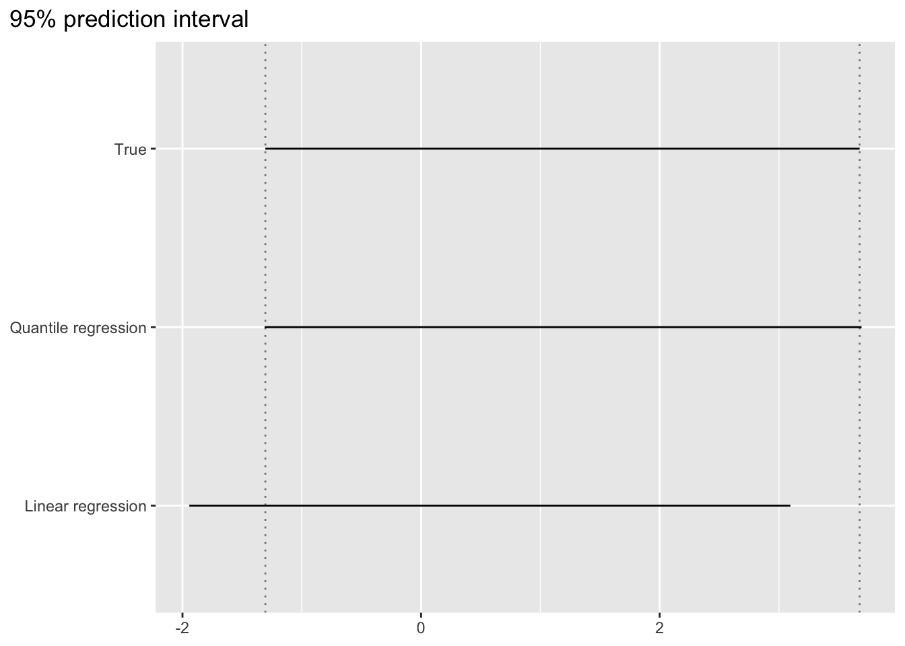
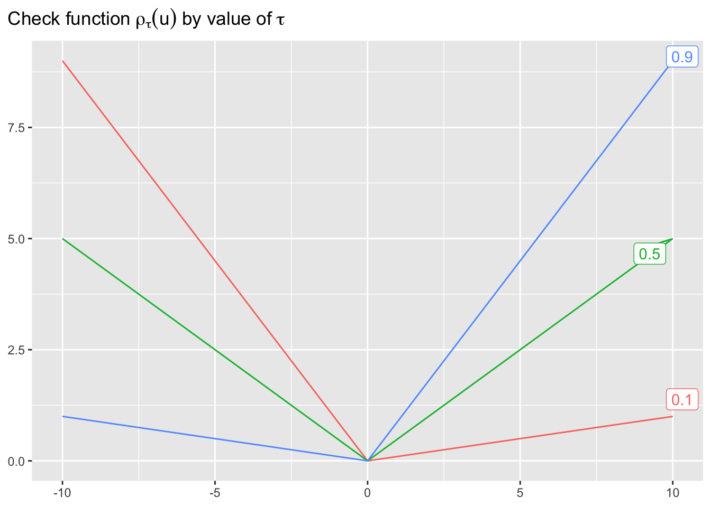

# Quantile linear regression {#quantile-linear-regression}


```r
library(extraDistr)
library(ggplot2)
library(ggtext)
library(ggrepel)
library(gt)
library(dplyr)
```

```
## 
## Attaching package: 'dplyr'
```

```
## The following objects are masked from 'package:stats':
## 
##     filter, lag
```

```
## The following objects are masked from 'package:base':
## 
##     intersect, setdiff, setequal, union
```

```r
library(tidyr)
library(rlang)
library(quantreg)
```

```
## Loading required package: SparseM
```

```
## 
## Attaching package: 'SparseM'
```

```
## The following object is masked from 'package:base':
## 
##     backsolve
```

```r
library(lpSolve)
```


우리가 흔히 사용하는 다중회귀분석(multiple linear regression)은 예측변수 $X$를 이용하여 연속형 반응변수 $Y$의 조건부 기대값, 즉 평균을 예측하는 데 주로 사용한다. 평균은 물론 매우 유용하고 대부분의 경우 가장 중요한 통계치이나, 경우에 따라서 평균과 더불어 반응변수의 분포를 예측하는 것이 의사결정에 큰 도움이 되는 상황들이 있다.

예를 들어, 에너지 산업의 경우, 재생 에너지 생산량의 예측값보다 실제 생산량이 적었을 때 발생하는 비용(e.g. 정전 등)이 실제 생산량이 많았을 때 발생하는 비용보다 크다고 가정하면, 보수적인 관점에서 평균 반응치보다는 좀 더 낮은 변위치(quantile)을 예측하고, 그에 기반하여 예비 전력을 준비하는 것이 적합할 수 있다.

물론, 다중회귀분석 결과를 이용하여 예측값의 범위를 추정할 수 있다. 하지만, 다중회귀분석에 적용되는 가정, 즉 실제 조건부 관측치의 분포가 예측변수 $X$값에 상관없이 "동일한 분산"의 "정규분포"를 따른다는 가정은 현실 문제에서 그대로 적용되기 쉽지 않다. 이러한 가정에 위배되는 데이터에 다중회귀분석이 추정하는 예측값의 범위를 사용할 경우, 그로 인해 의사결정 과정에서 최적과는 거리가 먼 결정을 내리게 될 수 있다.

Quantile linear regression은 반응변수의 분포에 대한 특정한 명시적 가정 없이, 연속형 반응변수 분포의 각 quantile과 예측변수 $X$간의 선형관계를 추정하는 방법이다. 


## Univariate의 예

반응변수 $Y$가 아래와 같은 Gumbel distribution을 따른다고 할 때,

\[
F(y) = \exp \left( -\exp \left( - \frac{y - \mu}{\sigma} \right) \right)
\]

$\mu = 0$, $\sigma = 1$ 에서의 분포는 아래 그래프와 같다.


위 standard Gumbel 분포에서 100,000개의 샘플을 추출한 뒤, 일반적인 최소자승 회귀분석과 quantile regression을 각각 적용하여 95% 예측구간(i.e. [2.5%, 97.5%])을 추정해보자. 이 예에서 예측변수는 존재하지 않으므로, 회귀모형은 y-절편값만을 구한다. 또한, $y$값의 실제 분포를 알고 있으므로, 실제 분포에서의 95% 구간을 구해보자.


```r
df_gumbel_random <- tibble(
  y = rgumbel(1e5)
)

true_interval <- qgumbel(c(0.025, 0.975)) %>%
  set_names(c("lwr", "upr"))

lm_interval <- lm(y ~ 1, df_gumbel_random) %>% 
  predict(newdata = tibble(.rows = 1), interval = "prediction", level = 0.95) %>%
  drop() %>%
  `[`(c("lwr", "upr"))

rq_interval <- rq(y ~ 1, df_gumbel_random, tau = c(0.025, 0.975)) %>%
  predict(newdata = tibble(.rows = 1)) %>%
  drop() %>%
  set_names(c("lwr", "upr"))
```

```
## Warning in rq.fit.br(x, y, tau = tau, ...): Solution may be nonunique

## Warning in rq.fit.br(x, y, tau = tau, ...): Solution may be nonunique
```

```r
df_prediction_interval <- t(cbind(true_interval, lm_interval, rq_interval)) %>%
  as_tibble(rownames = "method")
df_prediction_interval
```

```
## # A tibble: 3 x 3
##   method          lwr   upr
##   <chr>         <dbl> <dbl>
## 1 true_interval -1.31  3.68
## 2 lm_interval   -1.94  3.10
## 3 rq_interval   -1.31  3.69
```


아래 그래프에서, quantile regression을 사용하였을 때 실제 범위와 가깝게 추정되며, 일반 최소자승 회귀분석을 이용하였을 때에는 추정범위가 실제 범위로부터 멀어짐을 확인할 수 있다.




## Quantile

### 정의

연속형 변수 $Y$의 분포함수를 $F_Y(y) = P(Y \geq y)$라 할 때, $\tau \in (0, 1)$에 대해 $\tau$-quantile은 아래와 같이 정의된다.

\[
Q_Y(\tau) = F_Y^{-1}(\tau)
\]

예를 들어, $Y$가 $U(0, 1)$의 분포를 따를 경우, 0.3-quantile은 0.3이며, $U(0, 2)$의 분포를 따른 경우, 0.3-quantile은 0.6이다.


### Univariate 추정

분포 $F_Y(y)$로부터 $N$개의 샘플 $y_{(1)}, y_{(2)}, \ldots, y_{(N)}$을 추출하였다 할 때 ($y_{(1)} \leq y_{(2)} \leq \cdots \leq y_{(N)}$), 분포 $F_Y(y)$의 $\tau$-quantile을 추정하는 방법은 여러가지가 있다. R의 `stats::quantile()` 함수는 총 9가지 추정방법을 지원한다. 이 중, 첫 번째 방법(`type = 1`)에 대해 알아보자. 

\BeginKnitrBlock{note}<div class="note">**NOTE**: `stats::quantile()` 함수의 default는 `type = 7`으로 linear interpolation을 이용하며, 해당 방법이 quantile 추정에 더 적합하지만, 본 장에서 알아볼 quantile regression은 `type = 1`이 지원하는 quantile 추정 함수와 일관성이 있다.</div>\EndKnitrBlock{note}

우선, 분포 $F_Y(y)$를 $N$개의 샘플 $y_{(1)}, y_{(2)}, \ldots, y_{(N)}$을 이용하여 아래와 같이 추정한다.

\[
\hat{F}_Y(y) = \frac{1}{N} \sum_{i = 1}^{N} \mathbb{I}(y_{(i)} \leq y)
\]

예를 들어, 추출된 10개의 샘플의 값이 $y_{(1)} = 1, y_{(2)} = 2, \ldots, y_{(10)} = 10$이었다고 할 때, 분포 $F_Y(y)$은 아래와 같이 추정된다.


```r
y <- 1L:10L
Fy <- ecdf(y)
```


위에서 추정된 분포는 불연속적인 step function으로 그 역함수 $\hat{F}_Y^{-1}(\tau)$ 가 $\tau \in (0, 1$에 대해 정의되지 않는다. 이에 아래와 같이 quantile을 다시 정의해보자.

\[
Q_Y(\tau) = \inf \{y \, | \, F_Y(y) \geq \tau \}
\]

이 때, $F_Y(y)$ 대신 $\hat{F}_Y(y)$를 대입하여 $Q_Y(\tau)$를 와 같이 추정한다.

\[
\hat{Q}_Y(\tau) = \inf \{y \, | \, \hat{F}_Y(y) \geq \tau \}
\]


```r
quantile_Fy <- Vectorize(
  function(tau, Fy) {
    q_list <- eval(rlang::expr(x), environment(Fy))
    p_list <- eval(rlang::expr(y), environment(Fy))
    q_tau <- q_list[min(which(p_list >= tau))]
    return(q_tau)
  },
  "tau"
)
```


위에서 $\hat{Q}_Y(\tau)$는 $\tau \in [0, 1]$에서 정의되는 함수임을 볼 수 있다. 


### 최적화 문제

Check function $\rho_\tau(u)$를 아래와 같이 정의하자.

\begin{equation*}
\rho_\tau(u) = u \times (\tau - \mathbb{I}(u < 0)) = \begin{cases} 
  \tau |u|, & u \geq 0\\
  (1 - \tau) |u|, & u < 0
\end{cases}
\end{equation*}




이 때, 식

\[
\mathbf{E}[\rho_\tau(Y - \xi)] = \int_{-\infty}^{\infty} \rho_\tau(y - \xi) f(y) \, dy
\]

를 최소화하는 $\xi$값은 $Y$의 $\tau$-quantile 이다.

따라서, $Y$의 $N$개의 랜덤 샘플 $y_{(1)}, y_{(2)}, \ldots, y_{(N)}$이 주어졌을 때, $\tau$-quantile은 아래 목적식을 최소화하는 $\xi$값으로 추정할 수 있다.

\[
\frac{1}{N} \sum_{i = 1}^{N} \rho_\tau(y_{(i)} - \xi)
\]

여기에서, $\frac{1}{N}$는 최적해를 구하는 데 영향을 미치지 않으므로, $\tau$-quantile의 추정은 아래와 같이 표현할 수 있다.

\[
\hat{Q}_Y(\tau) = {\arg\min}_{\xi \in \mathbb{R}} \sum_{i = 1}^{N} \rho_\tau(y_{(i)} - \xi)
\]

위 최적화 문제는 선형 최적화 문제로 변환할 수 있다.

\begin{eqnarray*}
\min &=& \sum_{i = 1}^{N} \tau u_i^{+} + \sum_{i = 1}^{N} (1 - \tau) u_i^{-}\\
\text{s.t.} & &u_i^{+} - u_i^{-} = y_{(i)} - \xi, \; i = 1, \ldots, N\\
 & & u_i^{+}, u_i^{-} \geq 0, \; i = 1, \ldots, N
\end{eqnarray*}


```r
y <- 1L:10L

quantile_lp <- Vectorize(
  function(tau, y, penalty_xi = 1e-10) {
    n <- length(y)
    penalty_xi <- diff(range(y)) * penalty_xi
    obj_vec <- c(penalty_xi, - penalty_xi, rep(tau, length = n), rep(1 - tau, length = n))
    const_mat <- cbind(rep(1L, n), rep(-1L, n), diag(n), - diag(n))
    const_dir <- c(rep("="))
    const_rhs <- y
    res <- lp("min", obj_vec, const_mat, const_dir, const_rhs)
    opt_sol <- res$solution[1] - res$solution[2]
    return(opt_sol)
  },
  "tau"
)
```


```r
tibble(
  tau = seq(0, 1, by = 0.001),
  q = quantile_lp(tau, .env$y)
) %>%
  ggplot(aes(x = tau, y = q)) +
  geom_line() +
  scale_x_continuous(breaks = seq(0, 1, by = 0.1), minor_breaks = NULL) +
  scale_y_continuous(breaks = c(1:10), minor_breaks = NULL) +
  labs(
    x = NULL,
    y = NULL,
    title = expression("Optimal solution of "~xi~"by"~tau)
  ) +
  theme(
    plot.title.position = "plot"
  )
```


\BeginKnitrBlock{note}<div class="note">**NOTE**: `lpSolve::lp()`는 모든 실수형 변수를 0보다 크거나 같다고 가정한다. 따라서, $\xi \in \mathbb{R}$의 해를 구하기 위해서 $\xi = \xi^{+} - \xi^{-}$, $\xi^{+}, \xi^{-} \geq 0$ 의 방식으로 decision variable을 변환하였다.</div>\EndKnitrBlock{note}


\BeginKnitrBlock{note}<div class="note">**NOTE**: 위 예제 데이터에 최적화 모형을 그대로 적용하면, 일부 $\tau$값에서는 하나 이상의 최적해 값이 도출된다. 예를 들어, $\tau = 0.6$일 때, $\xi = 6$과 $\xi = 7$은 동일한 목적식 값을 얻는다. 이 때, $\tau$-quantile의 정의($\inf \{y \, | \, F_Y(y) \geq \tau \}$)에 의하면 작은 값 6을 $\xi$의 최적해로 얻어야 하나, 위 최적화 문제의 식에서는 6과 7 모두 동일하게 최적해로 판단하여 그 둘 중 하나를 `lpSolve::lp()` 함수의 결과값으로 리턴한다. 따라서, $\tau$값이 step function의 knot에 해당하는 경우에는 `lpSolve::lp()`의 결과값이 틀린 $\tau$-qunatile값을 리턴할 수 있다. 이를 해소하기 위해, 위에서 구현한 `quantile_lp()`함수에서는 목적식에 추가로 $\xi$값에 대한 임의의 작은 패널티를 부과하였다. 이는 간단하지만 안전한 방법이 아니며, 보다 안정적인 알고리즘의 구현이 필요하다.</div>\EndKnitrBlock{note}


## Quantile regression

### 최적화 문제

앞 장에서 살펴본 최적화 문제

\[
\hat{Q}_Y(\tau) = {\arg\min}_{\xi \in \mathbb{R}} \sum_{i = 1}^{N} \rho_\tau(y_{(i)} - \xi)
\]

는 예측변수가 존재하지 않는 경우를 가정하였다. 설명변수 $X \in \mathbb{R}^{d}$가 존재할 때, 주어진 예측변수에 값에 따라 $Y$의 분포가 달라진다면 (i.e. $F_{Y|X} \neq F_Y$), $Y$의 조건부 $\tau$-quantile $Q_{Y|X}(\tau)$을 추정하는 접근이 필요하다. 여기에서, 조건부 $\tau$-quantile이 아래와 같이 예측변수 $X = (x_1, \, \ldots, \, x_d)$의 affine 함수라 하자.

\[
Q_{Y|X}(\tau) = \beta_0 + \beta_1 x_1 + \cdots + \beta_d x_d
\]

위 함수의 $(d + 1)$개의 계수 $\beta_0, \ldots, \beta_d$를 관측된 $N$개의 데이터를 통해 추정함으로써, 임의의 예측변수값에 대해 $Y$의 조건부 $\tau$-quantile을 추정할 수 있다.

\[
\hat{Q}_{Y|X}(\tau) = \hat{\beta}_0 + \hat{\beta}_1 x_1 + \cdots + \hat{\beta}_d x_d
\]


$i$번째 관측 데이터의 예측변수 관측치를

\[
\mathbf{x}_i = (x_{i1}, \, \ldots, \, x_{id})
\]

라 하면, 계수 $\beta_0, \ldots, \beta_d$의 추정치는 아래 최적화 문제의 해로 얻어진다.

\[
\left(\hat{\beta}_0, \hat{\beta}_1, \ldots, \hat{\beta}_d \right) = {\arg\min}_{(\beta_0, \beta_1, \ldots, \beta_d)} \sum_{i = 1}^{N} \rho_\tau(y_{(i)} - \hat{\beta}_0 + \beta_1 x_{11} + \cdots + \beta_d x_{1d})
\]

위 식을 아래와 같이 보다 단순화해보자. 여기에서, 회귀계수가 $\tau$값에 따라 다르다는 것을 명시적으로 표현하기 위해 superscript $(\tau)$를 사용한다.

\[
\boldsymbol\beta = (\beta_0, \, \beta_1, \, \ldots, \beta_d)
\]

\[
\tilde{\mathbf{x}}_i = (1, \, x_{i1}, \, \ldots, x_{id})
\]

\[
\hat{\boldsymbol\beta}^{(\tau)} = {\arg\min}_{\boldsymbol\beta \in \mathbb{R}^{d + 1}} \sum_{i = 1}^{N} \rho_\tau(y_{(i)} - \tilde{\mathbf{x}}_i^\top \boldsymbol\beta)
\]


### Intercept only

앞 절에서 살펴본 univariate 추정 결과를 quantile regression 함수 `quantreg::rq()`를 이용하여 아래와 같이 재현해볼 수 있다. 예측변수가 없는 univariate 데이터이기 때문에 (i.e. $d = 0$), 모델에서는 intercept $\beta_0$만을 추정한다. (i.e. `formula = y ~ 1`).


```r
df <- tibble(y = 1L:10L)
rq_fit <- rq(y ~ 1, data = df, tau = seq(0, 1, by = 0.001))
```

```
## Warning in rq.fit.br(x, y, tau = tau, ...): Solution may be nonunique

## Warning in rq.fit.br(x, y, tau = tau, ...): Solution may be nonunique

## Warning in rq.fit.br(x, y, tau = tau, ...): Solution may be nonunique

## Warning in rq.fit.br(x, y, tau = tau, ...): Solution may be nonunique

## Warning in rq.fit.br(x, y, tau = tau, ...): Solution may be nonunique

## Warning in rq.fit.br(x, y, tau = tau, ...): Solution may be nonunique

## Warning in rq.fit.br(x, y, tau = tau, ...): Solution may be nonunique

## Warning in rq.fit.br(x, y, tau = tau, ...): Solution may be nonunique

## Warning in rq.fit.br(x, y, tau = tau, ...): Solution may be nonunique
```

```r
tibble(
  tau = seq(0, 1, by = 0.001),
  q = predict(rq_fit, tibble(.rows = 1L)) %>% drop()
) %>%
  ggplot(aes(x = tau, y = q)) +
  geom_line() +
  scale_x_continuous(breaks = seq(0, 1, by = 0.1), minor_breaks = NULL) +
  scale_y_continuous(breaks = c(1:10), minor_breaks = NULL) +
  labs(
    x = NULL,
    y = NULL,
    title = "Quantile regression estimates: intercept only"
  ) +
  theme(
    plot.title.position = "plot"
  )
```


### 예측 변수가 존재하는 경우

하나의 예측변수 $X$에 대해 두 가지의 값이 관측되었고 (0, 2), 각 경우에 대해 반응변수 $Y$가 아래와 같이 10번씩 관측되었다고 하자.


```r
df <- tibble(
  x = rep(c(0L, 2L), each = 10L),
  y = rep(1L:10L, times = 2L) + x
)
```

<!--html_preserve--><style>html {
  font-family: -apple-system, BlinkMacSystemFont, 'Segoe UI', Roboto, Oxygen, Ubuntu, Cantarell, 'Helvetica Neue', 'Fira Sans', 'Droid Sans', Arial, sans-serif;
}

#nqeryosyel .gt_table {
  display: table;
  border-collapse: collapse;
  margin-left: auto;
  margin-right: auto;
  color: #333333;
  font-size: 16px;
  font-weight: normal;
  font-style: normal;
  background-color: #FFFFFF;
  width: auto;
  border-top-style: solid;
  border-top-width: 2px;
  border-top-color: #A8A8A8;
  border-right-style: none;
  border-right-width: 2px;
  border-right-color: #D3D3D3;
  border-bottom-style: solid;
  border-bottom-width: 2px;
  border-bottom-color: #A8A8A8;
  border-left-style: none;
  border-left-width: 2px;
  border-left-color: #D3D3D3;
}

#nqeryosyel .gt_heading {
  background-color: #FFFFFF;
  text-align: center;
  border-bottom-color: #FFFFFF;
  border-left-style: none;
  border-left-width: 1px;
  border-left-color: #D3D3D3;
  border-right-style: none;
  border-right-width: 1px;
  border-right-color: #D3D3D3;
}

#nqeryosyel .gt_title {
  color: #333333;
  font-size: 125%;
  font-weight: initial;
  padding-top: 4px;
  padding-bottom: 4px;
  border-bottom-color: #FFFFFF;
  border-bottom-width: 0;
}

#nqeryosyel .gt_subtitle {
  color: #333333;
  font-size: 85%;
  font-weight: initial;
  padding-top: 0;
  padding-bottom: 4px;
  border-top-color: #FFFFFF;
  border-top-width: 0;
}

#nqeryosyel .gt_bottom_border {
  border-bottom-style: solid;
  border-bottom-width: 2px;
  border-bottom-color: #D3D3D3;
}

#nqeryosyel .gt_col_headings {
  border-top-style: solid;
  border-top-width: 2px;
  border-top-color: #D3D3D3;
  border-bottom-style: solid;
  border-bottom-width: 2px;
  border-bottom-color: #D3D3D3;
  border-left-style: none;
  border-left-width: 1px;
  border-left-color: #D3D3D3;
  border-right-style: none;
  border-right-width: 1px;
  border-right-color: #D3D3D3;
}

#nqeryosyel .gt_col_heading {
  color: #333333;
  background-color: #FFFFFF;
  font-size: 100%;
  font-weight: normal;
  text-transform: inherit;
  border-left-style: none;
  border-left-width: 1px;
  border-left-color: #D3D3D3;
  border-right-style: none;
  border-right-width: 1px;
  border-right-color: #D3D3D3;
  vertical-align: bottom;
  padding-top: 5px;
  padding-bottom: 6px;
  padding-left: 5px;
  padding-right: 5px;
  overflow-x: hidden;
}

#nqeryosyel .gt_column_spanner_outer {
  color: #333333;
  background-color: #FFFFFF;
  font-size: 100%;
  font-weight: normal;
  text-transform: inherit;
  padding-top: 0;
  padding-bottom: 0;
  padding-left: 4px;
  padding-right: 4px;
}

#nqeryosyel .gt_column_spanner_outer:first-child {
  padding-left: 0;
}

#nqeryosyel .gt_column_spanner_outer:last-child {
  padding-right: 0;
}

#nqeryosyel .gt_column_spanner {
  border-bottom-style: solid;
  border-bottom-width: 2px;
  border-bottom-color: #D3D3D3;
  vertical-align: bottom;
  padding-top: 5px;
  padding-bottom: 6px;
  overflow-x: hidden;
  display: inline-block;
  width: 100%;
}

#nqeryosyel .gt_group_heading {
  padding: 8px;
  color: #333333;
  background-color: #FFFFFF;
  font-size: 100%;
  font-weight: initial;
  text-transform: inherit;
  border-top-style: solid;
  border-top-width: 2px;
  border-top-color: #D3D3D3;
  border-bottom-style: solid;
  border-bottom-width: 2px;
  border-bottom-color: #D3D3D3;
  border-left-style: none;
  border-left-width: 1px;
  border-left-color: #D3D3D3;
  border-right-style: none;
  border-right-width: 1px;
  border-right-color: #D3D3D3;
  vertical-align: middle;
}

#nqeryosyel .gt_empty_group_heading {
  padding: 0.5px;
  color: #333333;
  background-color: #FFFFFF;
  font-size: 100%;
  font-weight: initial;
  border-top-style: solid;
  border-top-width: 2px;
  border-top-color: #D3D3D3;
  border-bottom-style: solid;
  border-bottom-width: 2px;
  border-bottom-color: #D3D3D3;
  vertical-align: middle;
}

#nqeryosyel .gt_from_md > :first-child {
  margin-top: 0;
}

#nqeryosyel .gt_from_md > :last-child {
  margin-bottom: 0;
}

#nqeryosyel .gt_row {
  padding-top: 8px;
  padding-bottom: 8px;
  padding-left: 5px;
  padding-right: 5px;
  margin: 10px;
  border-top-style: solid;
  border-top-width: 1px;
  border-top-color: #D3D3D3;
  border-left-style: none;
  border-left-width: 1px;
  border-left-color: #D3D3D3;
  border-right-style: none;
  border-right-width: 1px;
  border-right-color: #D3D3D3;
  vertical-align: middle;
  overflow-x: hidden;
}

#nqeryosyel .gt_stub {
  color: #333333;
  background-color: #FFFFFF;
  font-size: 100%;
  font-weight: initial;
  text-transform: inherit;
  border-right-style: solid;
  border-right-width: 2px;
  border-right-color: #D3D3D3;
  padding-left: 12px;
}

#nqeryosyel .gt_summary_row {
  color: #333333;
  background-color: #FFFFFF;
  text-transform: inherit;
  padding-top: 8px;
  padding-bottom: 8px;
  padding-left: 5px;
  padding-right: 5px;
}

#nqeryosyel .gt_first_summary_row {
  padding-top: 8px;
  padding-bottom: 8px;
  padding-left: 5px;
  padding-right: 5px;
  border-top-style: solid;
  border-top-width: 2px;
  border-top-color: #D3D3D3;
}

#nqeryosyel .gt_grand_summary_row {
  color: #333333;
  background-color: #FFFFFF;
  text-transform: inherit;
  padding-top: 8px;
  padding-bottom: 8px;
  padding-left: 5px;
  padding-right: 5px;
}

#nqeryosyel .gt_first_grand_summary_row {
  padding-top: 8px;
  padding-bottom: 8px;
  padding-left: 5px;
  padding-right: 5px;
  border-top-style: double;
  border-top-width: 6px;
  border-top-color: #D3D3D3;
}

#nqeryosyel .gt_striped {
  background-color: rgba(128, 128, 128, 0.05);
}

#nqeryosyel .gt_table_body {
  border-top-style: solid;
  border-top-width: 2px;
  border-top-color: #D3D3D3;
  border-bottom-style: solid;
  border-bottom-width: 2px;
  border-bottom-color: #D3D3D3;
}

#nqeryosyel .gt_footnotes {
  color: #333333;
  background-color: #FFFFFF;
  border-bottom-style: none;
  border-bottom-width: 2px;
  border-bottom-color: #D3D3D3;
  border-left-style: none;
  border-left-width: 2px;
  border-left-color: #D3D3D3;
  border-right-style: none;
  border-right-width: 2px;
  border-right-color: #D3D3D3;
}

#nqeryosyel .gt_footnote {
  margin: 0px;
  font-size: 90%;
  padding: 4px;
}

#nqeryosyel .gt_sourcenotes {
  color: #333333;
  background-color: #FFFFFF;
  border-bottom-style: none;
  border-bottom-width: 2px;
  border-bottom-color: #D3D3D3;
  border-left-style: none;
  border-left-width: 2px;
  border-left-color: #D3D3D3;
  border-right-style: none;
  border-right-width: 2px;
  border-right-color: #D3D3D3;
}

#nqeryosyel .gt_sourcenote {
  font-size: 90%;
  padding: 4px;
}

#nqeryosyel .gt_left {
  text-align: left;
}

#nqeryosyel .gt_center {
  text-align: center;
}

#nqeryosyel .gt_right {
  text-align: right;
  font-variant-numeric: tabular-nums;
}

#nqeryosyel .gt_font_normal {
  font-weight: normal;
}

#nqeryosyel .gt_font_bold {
  font-weight: bold;
}

#nqeryosyel .gt_font_italic {
  font-style: italic;
}

#nqeryosyel .gt_super {
  font-size: 65%;
}

#nqeryosyel .gt_footnote_marks {
  font-style: italic;
  font-size: 65%;
}
</style>
<div id="nqeryosyel" style="overflow-x:auto;overflow-y:auto;width:auto;height:auto;"><table class="gt_table">
  <thead class="gt_header">
    <tr>
      <th colspan="2" class="gt_heading gt_title gt_font_normal" style>Observed values of response variables Y in training data by value of X</th>
    </tr>
    <tr>
      <th colspan="2" class="gt_heading gt_subtitle gt_font_normal gt_bottom_border" style></th>
    </tr>
  </thead>
  <thead class="gt_col_headings">
    <tr>
      <th class="gt_col_heading gt_columns_bottom_border gt_center" rowspan="1" colspan="1">X = 0</th>
      <th class="gt_col_heading gt_columns_bottom_border gt_center" rowspan="1" colspan="1">X = 2</th>
    </tr>
  </thead>
  <tbody class="gt_table_body">
    <tr>
      <td class="gt_row gt_center">1</td>
      <td class="gt_row gt_center">3</td>
    </tr>
    <tr>
      <td class="gt_row gt_center">2</td>
      <td class="gt_row gt_center">4</td>
    </tr>
    <tr>
      <td class="gt_row gt_center">3</td>
      <td class="gt_row gt_center">5</td>
    </tr>
    <tr>
      <td class="gt_row gt_center">4</td>
      <td class="gt_row gt_center">6</td>
    </tr>
    <tr>
      <td class="gt_row gt_center">5</td>
      <td class="gt_row gt_center">7</td>
    </tr>
    <tr>
      <td class="gt_row gt_center">6</td>
      <td class="gt_row gt_center">8</td>
    </tr>
    <tr>
      <td class="gt_row gt_center">7</td>
      <td class="gt_row gt_center">9</td>
    </tr>
    <tr>
      <td class="gt_row gt_center">8</td>
      <td class="gt_row gt_center">10</td>
    </tr>
    <tr>
      <td class="gt_row gt_center">9</td>
      <td class="gt_row gt_center">11</td>
    </tr>
    <tr>
      <td class="gt_row gt_center">10</td>
      <td class="gt_row gt_center">12</td>
    </tr>
  </tbody>
  
  
</table></div><!--/html_preserve-->


위 데이터에서, $X = 0$인 경우 반응변수의 관측치는 앞 절의 예와 동일하며, $X = 2$인 경우 반응변수의 관측치는 $X = 0$인 경우보다 각각 2씩 일정하게 높게 관측되었다. 따라서, 이 데이터를 사용하여 조건부 quantile을 추정할 때, $X = 0$인 경우에는 앞 절과 동일하게 추정되며, $X = 2$에 대하여는 $X = 0$일 경우보다 2만큼 높은 값이 각각의 $\tau$에 대해 추정될 것을 예상할 수 있다. 즉, 

\[
\hat{\boldsymbol\beta}^{(\tau)} = \left(\hat{\beta}^{(\tau)}_0, \hat{\beta}^{(\tau)}_1\right)
\]

에서, $\hat{\beta}^{(\tau)}_1$의 값, 즉 예측변수 $X$에 대한 회귀계수는 $\tau$값에 상관없이 1일 것임을 예상할 수 있다.


$\tau$값을 0부터 1까지 0.001씩 증가시키며 회귀모형을 추정해보자.


```r
tau_list <- seq(0, 1, by = 0.001)
rq_fit <- rq(y ~ x, data = df, tau = tau_list)
```

```
## Warning in rq.fit.br(x, y, tau = tau, ...): Solution may be nonunique

## Warning in rq.fit.br(x, y, tau = tau, ...): Solution may be nonunique

## Warning in rq.fit.br(x, y, tau = tau, ...): Solution may be nonunique

## Warning in rq.fit.br(x, y, tau = tau, ...): Solution may be nonunique

## Warning in rq.fit.br(x, y, tau = tau, ...): Solution may be nonunique

## Warning in rq.fit.br(x, y, tau = tau, ...): Solution may be nonunique

## Warning in rq.fit.br(x, y, tau = tau, ...): Solution may be nonunique

## Warning in rq.fit.br(x, y, tau = tau, ...): Solution may be nonunique

## Warning in rq.fit.br(x, y, tau = tau, ...): Solution may be nonunique
```

이 때, 회귀분석 결과 객체의 원소 `rq_fit$coefficients`는 각 열이 $\tau$값, 각 행이 회귀계수를 나타내는 행렬이다.  여기에서 예측변수에 해당하는 회귀계수가 $\tau$값에 상관없이 일정하게 1로 추정됨을 확인해보자.


위 그래프에서, 추정된 intercept ($\hat{\beta}_0^{\tau}$) step function의 knots에 해당하는 $\tau$값(0.1, 0.2, ..., 0.9)을 제외하면, 예측변수에 해당하는 회귀계수가 $\tau$값에 상관없이 일정하게 1로 추정되었다.

\BeginKnitrBlock{note}<div class="note">**TO DO**: $\hat{\beta}_0^{\tau}$ step function의 knots에 해당하는 $\tau$값들에 대해서는 예측변수에 해당하는 회귀계수가 예상과 다르게 추정되었다. $\tau$가 step function의 knots에 해당할 때의 quantile regression 추정에 대해서는 저자가 충분히 알지 못하여, 추후 공부한 내용을 보강하고자 한다.</div>\EndKnitrBlock{note}


위에서 추정된 모형을 토대로, 새로운 데이터에 대해 $\tau$-quantile을 예측하기 위해 `predict()` 함수를 사용한다. 예측의 경우, 학습 데이터에서 관측되지 않았던 숫자형 예측변수 값에 대한 반응변수의 $\tau$-quantile 또한 예측할 수 있다. 아래에서, 학습 데이터에서 관측되었던 $X = 0$, $X = 2$에 더해, 학습데이터에서 관측되지 않았던 $X = 1$인 경우에 대한 $\tau$-quantile을 예측해보자.


```r
df_predicted <- tibble(
  x = rep(c(0L, 1L, 2L), times = length(tau_list)),
  tau = rep(tau_list, each = 3L),
  q = c(predict(rq_fit, tibble(x = c(0L, 1L, 2L))) %>% as.vector())
)
```


위 그래프에서, $X = 2$인 경우의 $\tau$-quantile 예측값은 $X = 0$인 경우보다 2씩 일정하게 높음을 확인할 수 있다. 또한, $X = 1$인 경우의 $\tau$-quantile 예측값은 $X = 0$인 경우보다 1씩 일정하게 높음을 확인할 수 있다.

