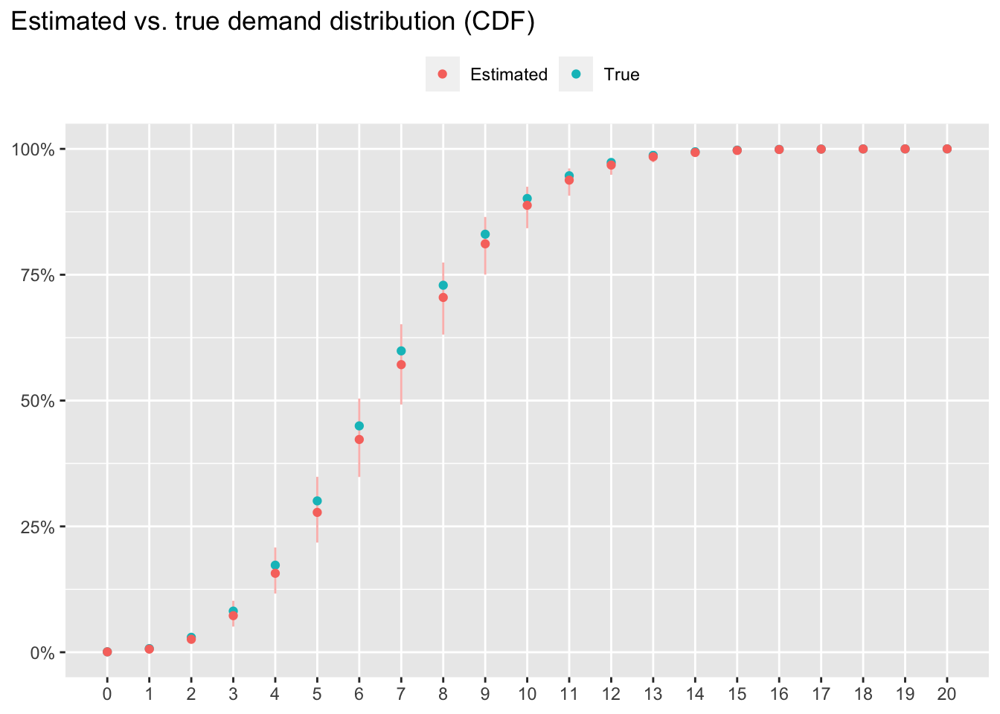
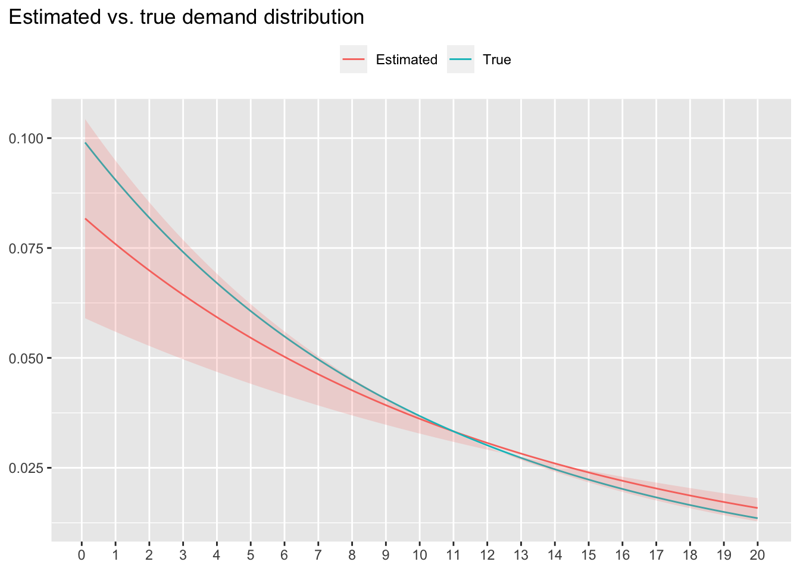

# Censored data  {#censored-data}


```r
library(ggplot2)
library(ggtext)
library(ggrepel)
library(gt)
library(dplyr)
library(tidyr)
library(stringr)
library(rlang)
library(purrr)
```

확률분포나 통계모형을 추정할 때 가장 흔히 사용되는 방법이 최우추정법(maximum likelihood estimation)이다. 이 때 likelihood는 주어진 데이터가 어떠한 확률분포로부터 관측될 결합확률(joint probability)을 뜻한다. 이 때, likelihood 함수는  주어진 데이터의 성격에 맞게 정의되어야 한다.

기초 통계 수업에서는 주로 정확한(precise) 값이 관측된다고 가정한다. 하지만, 경우에 따라 분포를 알고자 하는 값이 정확하게 관측되지 못하고, 단지 정확한 실제값이 어떤 범위 내에 존재하는지만 알 수 있는 경우가 있다. 예를 들어, 매일 아침 10개의 재고가 존재하는 제품에 대해 기록된 일간 판매량을 토대로 일간 수요의 분포를 추정한다고 하자. 이 때, 제품 재고 10개가 모두 소진된 날의 경우, 판매량은 10개이지만 실제 수요는 "10개보다 크거나 같았다"와 같이 정확한 수요값이 존재했을 범위를 고려하는 것이 합리적인데, 이는 재고가 더 많이 존재했을 경우 더 많은 판매가 이루어졌을 가능성이 있기 때문이다. 이러한 경우, 관측된 범위 데이터를 **censored data**라 한다. 본 장에서는 이러한 censored data가 존재할 때 최우추정법을 위한 likelihood 함수를 어떻게 정의하는지 살펴보자.


## Right censored data

Right censored data는 실제값이 존재하는 범위의 lower bound가 관측되는 경우이다. 바로 앞에서 언급한 예와 같이, 재고량이 10개인 제품이 모두 판매되어 품절되었을 때, 제품에 대한 수요에 대한 lower bound 10은 관측되지만, 실제 수요가 11개였을지 20개였을 지는 알 수 없는 경우이다.

아래와 같이 데이터를 정의해보자.

- $N$: 전체 관측 데이터 수.
- $y_i$: $i$번째 관측치에 대응하는 실제값. 이 변수는 항상 관측 가능한 변수가 아니다. 예를 들어, $i$번째 날짜에 해당 일자에 대한 재고 10개가 모두 판매되어 품절되었을 경우, 재고가 충분했다면 15개가 판매되었을 것이라면 $y_i = 15$이지만, 이 실제값은 관측 가능한 값이 아니다. 
- $\tilde{y}_i$: $i$번째 관측치에 대응하는 관측값. 위에서 언급한 경우와 같이 $i$번째 날짜에 해당 일자에 대한 재고 10개가 모두 판매되어 품절되었을 경우, $\tilde{y}_i = 10$으로 관측된다.
- $r_i$: $i$번째 관측치가 right censored data인지 아닌지 여부에 대한 지시변수. $i$번째 관측치가 right censored data라면 $r_i = 1$, 아니라면 $r_i = 0$으로 관측된다. 이 지시변수는 항상 관측 가능한 값이다. 예를 들어, $i$번째 날짜에 재고가 소진되어 더 이상 제품 판매가 불가능했다면, $r_i = 1$로 관측된다.

이 때, $y_i$와 $\tilde{y}_i$는 $r_i$값에 따라 아래와 같은 관계를 보인다.

$$
\begin{cases}
  y_i = \tilde{y}_i & \text{if } r_i = 0 \\
  y_i \geq \tilde{y}_i & \text{if } r_i = 1
\end{cases}
$$

전체 관측 데이터 $D$는 아래와 같이 $N$개의 $\tilde{y}_i$와 $r_i$의 쌍으로 이루어진다.

$$
D = \left\{(\tilde{y}_i, r_i): i = 1, \ldots, N\right\}
$$

해당 관측 데이터에 대한 likelihood값의 계산은 실제값 변수 $Y$가 이산형(discrete) 변수인지 연속형(continuous) 변수인지에 따라 달라진다.


### 이산형 변수

변수 $Y$에 대한 확률질량함수 $P(Y = y)$를 이용하여 관측 데이터의 likelihood를 아래와 같이 정의된다.

$$
L(D) = \prod_{i = 1}^{N} P(Y = \tilde{y}_i)^{1 - r_i} \left(1 - P(Y < \tilde{y}_i)\right)^{r_i}\\
= \prod_{i = 1}^{N} P(Y = \tilde{y}_i)^{1 - r_i} P(Y \geq \tilde{y}_i)^{r_i}
$$

즉, 정확한 실제값을 관측한 경우 ($r_i = 0$), 확률질량함수 $P(Y = \tilde{y}_i)$값이 해당 값을 관측할 likelihood이다. 반면, right censored data인 경우 ($r_i = 1$), 관측된 정보는 "$y_i$가 $\tilde{y}_i$보다 작지 않다"이므로, 변수 $Y$가 $\tilde{y}_i$보다 작지 않을 확률 $1 - P(y_i < \tilde{y}_i)$를 likelihood로 사용한다.


#### 예제

유통기한이 단 하루인 제품이 있다고 하자. 100일동안 매일 아침 가게 문을 열 때 제품을 10개를 생산해서 준비해두고, 매일 저녁 가게 문을 닫을 때까지 제품이 몇 개 팔렸는지를 기록해두었다 하자. 각 날짜의 제품의 수요는 서로 독립이며 평균($\lambda$)이 7인 Poisson distribution을 따른다고 가정하자. 단, 판매자는 실제 평균 수요를 알지 못하고, 100일동안 관측된 데이터를 이용하여 수요의 분포를 추정하려고 한다.

$$
y_i \overset{i.i.d.}{\sim} Pois(7)
$$


```r
set.seed(30)
N <- 100
lambda_true <- 7
daily_inventory <- 10L
observed <- tibble(
  day = seq_len(N),
  daily_sales = pmin(rpois(N, 7), daily_inventory),
  sold_out = if_else(daily_sales < daily_inventory, 0, 1)
)
```


Table: (\#tab:unnamed-chunk-3)첫 열흘 동안의 판매량 기록

| day| daily_sales| sold_out|
|---:|-----------:|--------:|
|   1|           4|        0|
|   2|           7|        0|
|   3|           6|        0|
|   4|           6|        0|
|   5|           6|        0|
|   6|           4|        0|
|   7|          10|        1|
|   8|           5|        0|
|   9|          10|        1|
|  10|           4|        0|

위 데이터에서 `daily_sales`열이 $\tilde{y}_i$, `sold_out`열이 $r_i$ 값을 저장한다. 실제 수요값이 10인 경우, 관측된 판매량과 실제 수요가 일치하지만, 판매자의 입장에서는 실제 수요가 더 이상 없었을 것이라는 사실을 알 수가 없다. 실제 수요가 더 있었다 하더라도 수요자의 입장에서 구매할 수가 없었으므로, 판매량은 동일하게 10이며, 따라서 판매자의 입장에서는 판매량이 10인 경우 right censored data라고 가정한다.

위 데이터를 이용하여 Poisson distribution의 파라미터 $\lambda$의 maximum likelihood estimate을 구해보자. 우선, likelihood function을 아래와 같이 정의한다.

$$
L(D \, | \, \lambda) = \prod_{i = 1}^{100} \left(\frac{\lambda ^ {\tilde{y}_i} \exp(-\lambda)}{\tilde{y}_i!}\right)^{1 - r_i} \left(1 - \sum_{k = 0}^{\tilde{y}_i - 1} \frac{\lambda ^ {k} \exp(-\lambda)}{k!} \right) ^ {r_i}
$$

이 때, 주어진 데이터 모형으로부터 $r_i = 1$ 일 때 $\tilde{y}_i$값은 항상 10임을 추론할 수 있으므로, likelihood function은 아래와 같이 정리할 수 있다.

$$
L(D \, | \, \lambda) = \prod_{i = 1}^{100} \left(\frac{\lambda ^ {\tilde{y}_i} \exp(-\lambda)}{\tilde{y}_i!}\right)^{1 - r_i} \, p^{r_i}\\
p = 1 - \sum_{k = 0}^{9} \frac{\lambda ^ {k} \exp(-\lambda)}{k!}
$$

Log-likelihood function은 아래와 같이 정리된다.

$$
logL(D \, | \, \lambda) = \sum_{i = 1}^{100} (1 - r_i) \left(\tilde{y}_i \log \lambda - \lambda - \sum_{k = 1} ^ {\tilde{y}_i} \log k\right) + r_i \log p\\
p = 1 - \sum_{k = 0}^{9} \frac{\lambda ^ {k} \exp(-\lambda)}{k!}
$$


```r
fn_loglik <- function(lambda, y, rc) {
  sum(dpois(y, lambda, log = TRUE) * (1 - rc) +
    ppois(y, lambda, lower.tail = FALSE, log.p = TRUE) * rc)
}
```

위 log-likelihood function을 이용하여 수요분포 파라미터 $\lambda$의 maximum likelihood estimate을 구해보자.


```r
y <- observed %>% pull(daily_sales)
rc <- observed %>% pull(sold_out)

res <- optim(
  par = 5,
  fn = fn_loglik,
  control = list(fnscale = -1),
  hessian = TRUE,
  y = y, rc = rc
)
```

```
## Warning in optim(par = 5, fn = fn_loglik, control = list(fnscale = -1), : one-dimensional optimization by Nelder-Mead is unreliable:
## use "Brent" or optimize() directly
```

```r
lambda_estimate <- res$par
lambda_se <- drop(sqrt(- 1 / res$hessian))
```




추정된 파리미터값은 $\hat{\lambda} = 6.5410156$이며 표준오차는 $se(\hat{\lambda}) = 0.2599846$이다. 추정된 95% 신뢰구간은 위 그래프에서 실제 분포를 포함하는 것을 볼 수 있다.


### 연속형 변수

실제값 $y_i$가 분포함수 $F(y)$로부터 얻어진다고 하자.

$$
y_i \overset{i.i.d.}{\sim} F(y)
$$

또한 분포함수 $F(y)$에 대응하는 확률밀도함수를 $f(y)$라 하자. 

$$
f(y) = \frac{\partial F(y)}{\partial y}
$$

이 때, likelihood는 아래와 같이 정의된다.

$$
L(D) = \prod_{i = 1}^{N} f(\tilde{y}_i)^{1 - r_i} \left(1 - F(\tilde{y}_i)\right)^{r_i}
$$

즉, 정확한 실제값을 관측한 경우 ($r_i = 0$), 확률밀도함수 $f(y)$값이 해당 값을 관측할 likelihood이다. 반면, right censored data인 경우 ($r_i = 1$), 확신할 수 있는 정보는 $y_i \geq \tilde{y}_i$이므로, 

$$
P(y_i \geq \tilde{y}_i) = 1 - P(y_i < \tilde{y}_i)\\
= 1 - F(\tilde{y}_i)
$$
가 해당 관측값을 얻을 likelihood이다.

연속형 변수에 대한 예제는 다음 절에서 left censored data를 다룰 때 함께 살펴보기로 하자.


## Left censored data

Left censored data는 실제값이 존재하는 범위의 upper bound가 관측되는 경우이다. 즉, 실제값이 어떠한 값보다 작거나 같았다라는 사실을 관측할 수 있으나, 정확한 실제값을 측정할 수는 없는 경우이다. 본 절에서는 연속형 변수에 대해서만 설명하기로 한다.

Right censored data와 left censored data가 모두 존재하는 다음과 같은 예를 생각해보자. 

---
구매자와 판매자 간에 각 거래에서 제품 가격은 판매자가 결정하여 제시한다고 가정하자. 구매자 각자는 본인이 희망하는 제품 가격이 상한이 있으며, 이를 희망가격이라 하자. 하지만, 이 희망가격은 판매자가 알 수 없으며, 따라서 판매자는 각 구매자의 희망 가격과는 독립적으로 제품 가격을 설정하여 제시한다. 이 때, 거래가 성사되기 위해서는 구매자가 희망했던 가격이 판매자가 제시한 제품 가격보다 높아야 한다. 즉, 구매자가 희망했던 가격보다 제품가격이 저렴할 때 거래가 성립한다. 만약 구매자가 희망했던 가격이 제품 가격보다 낮은 경우, 즉 제품 가격이 구매자의 희망보다 비싼 경우에는 거래가 성립하지 않는다.
---

위 예에서, 판매자가 여러 구매자들과의 거래를 통해, 구매자들의 희망가격의 분포를 추정하려 한다고 하자. 판매자의 입장에서 관측할 수 있는 데이터는 판매자 본인이 제시했던 제품 가격과 거래가 성사되었는지의 여부이다. 이 때, 거래 성사 여부에 따라 관측된 데이터가 right censored data인지 left censored data인지를 알 수 있다.

- 거래가 성사된 경우, 구매자의 희망가격($y_i$)의 정확한 값은 모르지만, 판매자의 제시가격($\tilde{y}_i$)보다 높았다는 사실을 알게 되므로, right censored data이다.
- 거래가 성사되지 않은 경우, 구매자의 희망가격($y_i$)의 정확한 값은 모르지만, 판매자의 제시가격($\tilde{y}_i$)보다 낮았다는 사실을 알게 되므로, left censored data이다.

앞 절에서 정의했던 수식 기호에 더하여, left censored data 지시변수를 아래와 같이 추가로 정의하자.

- $l_i$: $i$번째 관측치가 left censored data인지 아닌지 여부에 대한 지시변수. $i$번째 관측치가 left censored data라면 $l_i = 1$, 아니라면 $l_i = 0$으로 관측된다.

이 때, 관심변수의 실제값 $y_i$와 관측값 $\tilde{y}_i$간의 관계는 지시변수 $r_i$와 $l_i$의 값에 따라 아래와 같다.

$$
\begin{cases}
  y_i = \tilde{y}_i & \text{if } \, l_i = 0 \, \text{ and } \, r_i = 0\\
  y_i \geq \tilde{y}_i & \text{if } \, l_i = 0 \, \text{ and } \, r_i = 1\\
  y_i \leq \tilde{y}_i & \text{if } \, l_i = 1 \, \text{ and } \, r_i = 0
\end{cases}
$$
전체 관측 데이터 $D$는 아래와 같이 $N$개의 $\tilde{y}_i$와 $l_i$, 그리고 $r_i$의 쌍으로 이루어진다.

$$
D = \left\{(\tilde{y}_i, l_i, r_i): i = 1, \ldots, N\right\}
$$

이 때, likelihood는 아래와 같이 정의된다.

$$
L(D) = \prod_{i = 1}^{N} f(\tilde{y}_i)^{1 - l_i - r_i} F(\tilde{y}_i)^{l_i} \left(1 - F(\tilde{y}_i)\right)^{r_i}
$$

#### 예제

앞에서 언급한 구매자의 희망가격 분포를 추정하는 예에 대해 실제 추정과정을 살펴보자.

구매자 각자는 서로 다른 희망가격을 마음에 품고 있는데, 이는 서로 독립이며 평균($1 / \lambda$)이 10만원인 Exponential distribution을 따른다고 가정하자. 단, 판매자는 구매자의 평균 희망가격을 알지 못하고, 100명의 구매자와의 거래 시도를 통해 관측된 데이터를 이용하여 희망가격의 분포를 추정하려고 한다.

$$
y_i \overset{i.i.d.}{\sim} Exp(\lambda)
$$

판매자가 각 구매자에게 무작위로 서로 다른 가격을 제시하였다고 하자. 이 때, 각 구매자에게 제시된 가격은 서로 독립이며 평균이 9이고 표준편차가 2인 정규분포로부터 추출된 무작위 샘플이라 하자.

$$
\tilde{y}_i \overset{i.i.d.}{\sim} N(9, 2^2)
$$


```r
set.seed(31)
N <- 100
lambda_true <- 1 / 10
mu_tilde <- 9
sigma_tilde <- 2

observed <- tibble(
  customer = seq_len(N),
  upper_limit = rexp(N, lambda_true),
  offer = rnorm(N, mu_tilde, sigma_tilde),
  is_accepted = if_else(offer <= upper_limit, 1, 0),
  is_rejected = if_else(offer > upper_limit, 1, 0)
)
```


Table: (\#tab:unnamed-chunk-8)첫 열 명의 구매자와의 거래 결과

| customer| upper_limit|     offer| is_accepted| is_rejected|
|--------:|-----------:|---------:|-----------:|-----------:|
|        1|   0.4431583| 10.908619|           0|           1|
|        2|   2.9419262|  4.507467|           0|           1|
|        3|   3.1340344|  9.060761|           0|           1|
|        4|  17.6789979|  9.804956|           1|           0|
|        5|   1.6851793| 12.316684|           0|           1|
|        6|   6.6046450|  5.295574|           1|           0|
|        7|   3.0373506| 12.301354|           0|           1|
|        8|  42.3869027|  7.171987|           1|           0|
|        9|  26.9941280| 10.744140|           1|           0|
|       10|   7.6777810| 10.346243|           0|           1|

위 데이터에서 `is_accept`는 거래가 성사되었으면 1, 아니면 0을 지니며, right censored data 지시변수 $r_i$에 대응한다. 또한 `is_rejected`는 거래가 성사되었으면 0, 아니면 1을 지니며, left censored data 지시변수 $l_i$에 대응한다. 각 관측치는 left censored data이거나 right censored data이며, 판매자가 구매자의 희망가격을 정확히 아는 경우는 없다고 보는 것이 합리적일 것이다.

따라서, likelihood function은 아래와 같이 정의된다.

$$
L(D \, | \, \lambda) = \prod_{i = 1}^{100} \left(1 - \exp(-\lambda \tilde{y}_i)\right)^{l_i} \left(\exp(-\lambda \tilde{y}_i)\right)^{r_i}
$$

그리고, log-likelihood function은 아래와 같이 정의된다.

$$
l(D \, | \, \lambda) = \sum_{i = 1}^{100} l_i \log \left(1 - \exp(-\lambda \tilde{y}_i)\right) - r_i \lambda \tilde{y}_i
$$


```r
fn_loglik <- function(lambda, y, lc, rc) {
  sum(pexp(y, lambda, lower.tail = TRUE, log.p = TRUE) * lc +
    pexp(y, lambda, lower.tail = FALSE, log.p = TRUE) * rc)
}
```

위 log-likelihood function을 이용하여 수요분포 파라미터 $\lambda$의 maximum likelihood estimate을 구해보자.


```r
y <- observed %>% pull(offer)
lc <- observed %>% pull(is_rejected)
rc <- observed %>% pull(is_accepted)

res <- optim(
  par = 1 / 20,
  fn = fn_loglik,
  control = list(fnscale = -1),
  hessian = TRUE,
  y = y, lc = lc, rc = rc
)
```

```
## Warning in optim(par = 1/20, fn = fn_loglik, control = list(fnscale = -1), : one-dimensional optimization by Nelder-Mead is unreliable:
## use "Brent" or optimize() directly
```

```r
lambda_estimate <- res$par
lambda_se <- drop(sqrt(- 1 / res$hessian))
```




추정된 파리미터값은 $\hat{\lambda} = 0.0824023$이며 (즉, 추정된 평균 희망가격은 12.1355772만원이며) 표준오차는 $se(\hat{\lambda}) = 0.0117518$이다. 추정된 95% 신뢰구간은 위 그래프에서 실제 분포를 포함하는 것을 볼 수 있다.


## Interval data


Interval data는 실제값이 존재하는 범위의 lower bound와 upper bound가 모두 관측되는 경우이다.


